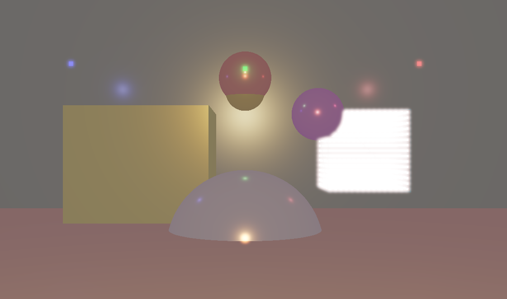
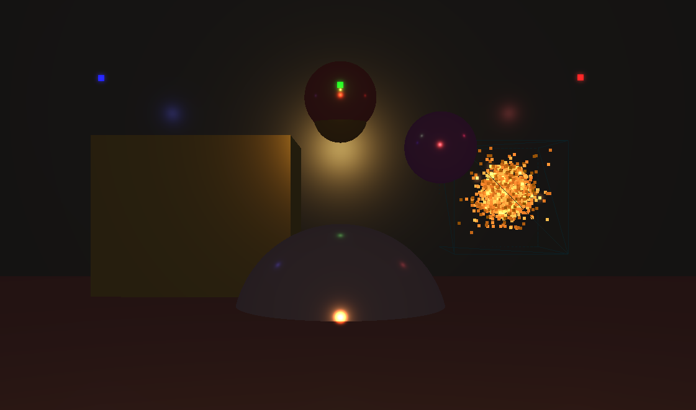
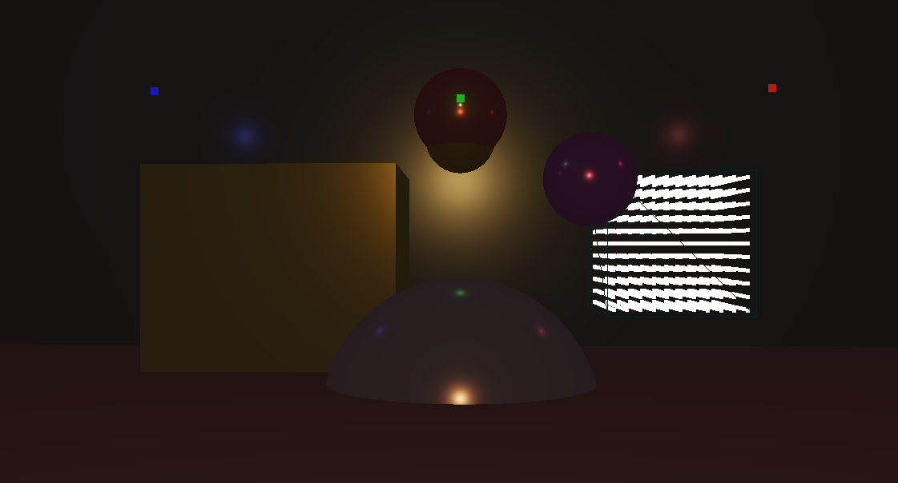
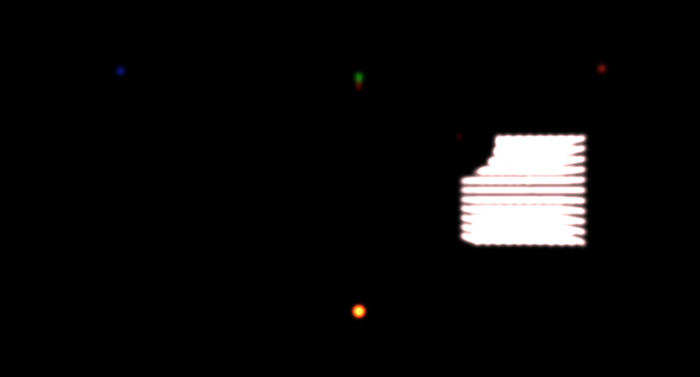

# Project Animation simulation and rendering

## Installation

```bash
  git clone git@github.com:jmaleo/OpenGLBezierProject.git
  cd OpenGLBezierProject
  mkdir build && cd build
  cmake .. && make -j20
```

## What's inside

* The initial idea for the rendering was to create a little scene with boxes, spheres and lights in order to implement the microfacet rendering method and also the HDR / Bloom.
This was, in my opinion, completely done. Maybe it could be great to play with the tonemap or adjust methods, maybe add elements or even create materials.
This part took me maybe around 15 to 20 hours. I wanted to have a good structure, and manage as possible the creation of objects. In that case, it's easy to change the scene. Here, there are only boxes, but in less than 10 lines we can adjust the creation to change the length of the boxes for each direction. 

* For the simulation, the idea was to create, firstly, a fluid simulation. As it was new for me, I wanted to play with particle in a first plan.
More and more the development was, and more and more the difficulties appeared. Also, this kind of development was completely new. So, I was checking references in google to see how to play with particles. 
In a certain manner, it's used to compute the collision into the GPU. But, as I'm not familiar with it, I needed to use an accelerated structure to compute it from the CPU. I used the voxel grid. 
The simulation is simpler than what I wanted firstly. In fact, there is only an initial speed, and collision. The simulation could easily be changed as the particle classes and the particle container contains all of we want to adjust the collision, the physical functions, ...
This part took me maybe the same as the first part, around 20 hours. I was a little bit slow because I needed to read some documentation on how it works and all.

### What can be updated

* The changes that I wanted to add is to allow the user to create a scene from scratch. The code is almost there for creating objects into the scene, I just need to adapt a few lines, that's it. 
* I want to add more materials or parameters to change in order to play with it and enjoy. 
* I need to update the creation of the boxes, because, just by adjusting one function, I can easily provide lengths of each direction.

* For the particles, maybe it could be worth to change the formula for the collision, and adapt the code for the update of the position, by using the acceleration parameters (present in the code). 
* Also, for the rendering of particles, it could be great to use a BillBoard method to have nice little balls.

* For the particle containers, I wanted to add a parameter when you select an object, to allow the user to choose in which box the particle simulation will be. For the moment, it is not possible, but it'll not take a lot of time to develop, as there is currently boolean and other parameters in the GUI / rendering method to say : IT'S A PARTICLE CONTAINER. 

## Move arround the scene

* To move arround the scene, you can use the mouse and the ZQSD keys.

## Description of the interface

The interface is mainly composed of many tools, widgets. 

* The first one allows the user to see or not the scene. 
If the user wants to see the scene, he can click on the button "Show scene".
If it's true, the scene is displayed and also others widgets are displayed.
* The second one allows the user to show or not objects, or lights.
Also, this widget provides a list of tools to use the rendering status (bloom / hdr / only bright points after bluring).

If the user wants to see objects, he can click on the button "Show objects".
If it's true, the objects are displayed.
* The third one allows the user to select the objects.
There is a list of objects to choose, following the visible objects.

If you click on one of them, the object is blinking and a little widget is displayed.
* This little widget allows the user to move the object, to change the color and the variables of the materials for the microfacet rendering.

If the user wants to see lights he can click on the button "Show lights" of the second widget.
If it's true, the lights are displayed.
* The fourth one allows the user to select lights and also add lights.
There is a list of lights to choose, following the visible lights.

If you click on one of them, the light is blinking and a little widget is displayed.
* This little widget allows the user to move the light, to change the color.


* The last widget allows the user to play with particles. 
You can stop the simulation, change the time between each frame, change the number of particles, change the distribution of the particles inside the box.

## Description of the scene

Here is the initial scene.



## Indications

When you want to add lights, make sure to press ESC to quit the application, as the GLSL shaders are overwritte when adding lights.
To make sure the tool works, when restarting the application, you can just re cmake .. the project, only to make sure the shaders are correct.


## Images 

Little video of the scene.


Initial Scene.


Initial scene without HDR.


Initial scene without HDR and BLOOM.


Initial scene with only bright blurred points.

