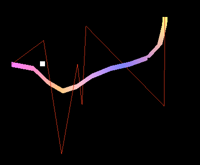
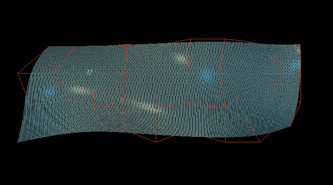
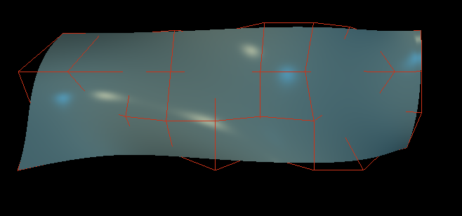
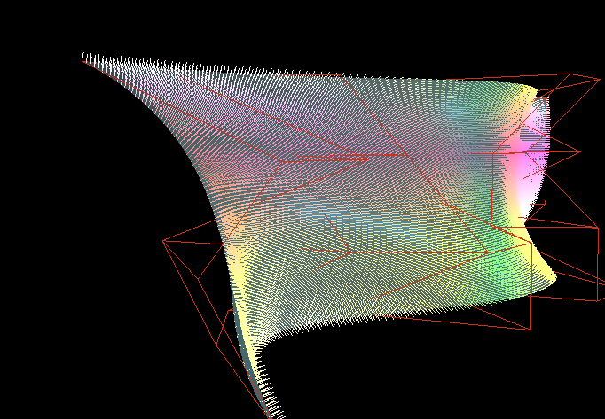
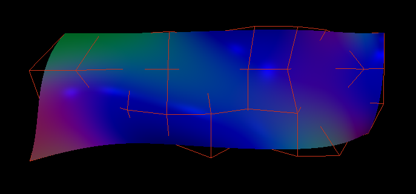

# OpenGLBezierProject

This project is a little application of Bezier Curve and Surface, written in C++ with the help of the openGL Library.
You may interact with a 3D scene, to visualise curves or surfaces randomly generated.
- Be careful : there is the compiled application on the application directory. If you want to compile the algorithm, you need to import the project into Visual Studio.

# The scene contains
  - 3 light sources, visualised as points (there is 1 light at the back of the scene, and 2 behind the view).
  - Following the curve mode (Curve with nbLines lines, Curve with nbLength for each lines, Surface) you'll have different visualisations :
      For each visualisation, you can see the control points in orange.
      -> Curve (both) : Lines correspond to the position of each points
      -> Surface : 3 modes, the first corresponds to the surface color defined in the algorithm, with the lighting of each 3 points,
                   the second corresponds to the normals of the surface, visualised as lines, orthogonal at each points,
                   the last is the normals visualised as color interpolled, also with the lighting of each 3 points.
  - During the running of the application, you can see the scene as a FPS view, and go through the scene by pressing ZQSD of your keyboard.
## Some tools
  - As said above, there is differents way to visualize the curve / surface. So, you can choose to see or not the surface or the curve, and also the control points.
  - You can also choose to see 2 normals parameters (as lines or as color).
  - For the curves, you can play with parameters like nbLines or nbLength.
  - You can generate randomly new control points at any time.
 

# How to use the program
- By pressing C on your keyboard, you can change between a bezier curve with X lines, a bezier curve with lines of Y length and a bezier surface.
- By pressing P you can see the control polynom.
- By pressing B you may show or not Curve or Surface.
- By pressing R you may generate a new set of random control points.
- During the curve scene, you may play with right or left arrow to change parameters as nbLength or nbLines.
- During the surface scene, you can press on N to see normal as lines or normal as color (interpoled).
- During the surface scene, you can press L to toggle wireframe display. 

# Notes 
For instance, as define in the algorithm, the control surface is define as a 10 X 4 points, only the Z axis will change thanks to the algorithm (it's possible to change it in the algorithm).
There is also a limitation for the curve control points.

## Problems
 - For the curve, by using a curve where each lines have the same length, there is a problem, and the last line just connect to the last control point, without taking into account if it corresponds to the length mentioned.

# Images of the application

 

